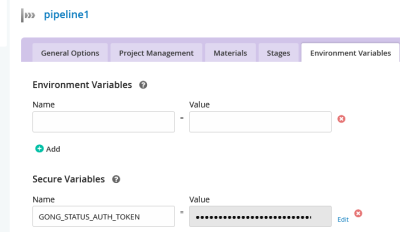

## Gong Notifier GitHub PR Status

This plugin will update the commit status of pull-requests on GitHub. This assumes GoCD is building 
pull-requests with the  [github-pr-poller plugin](https://github.com/ashwanthkumar/gocd-build-github-pull-requests).

It will set the commit status to **pending**, **success**, **failed**, or **error** depending on the status of
the associated GoCD pull-request pipeline.

Instead of requiring a **central** authentication token for GitHub, the plugin allows each pipeline owner
to define their own authentication token in a secure environment variable in the pipeline configuration.

## Plugin installation

Just drop the plugin jar into ```plugins/external``` and restart the server as per
[official guide](https://docs.gocd.org/current/extension_points/plugin_user_guide.html).

### Configuration

There are a number of global configuration settings for the plugin that can be set in the GoCD server plugins view.

The property keys are listed in brackets and can be used to configure the plugin via the GoCD REST API.

* **Server Display URL (serverDisplayUrl)** 
  * The base url to use when linking to the GoCD GUI in mails 
  * **Default:** ```https://localhost:8154/go```
* **REST URL (serverUrl)** 
  * The base url to use when making REST calls to the GoCD server 
  * **Default:** ```http://localhost:8153/go```
* **REST user name (restName)** 
  * The user to use when authorizing against an admin REST interface of the GoCD server 
  * **Default:** [none]
* **REST user password (restPassword)** 
  * The password to use when authorizing against an admin REST interface of the GoCD server 
  * **Default:** [none]
* **Cipher Key File (cipherKeyFile)** 
  * The `cipher.aes` file which the GoCD server uses to encrypt and decrypt secure variables.
  This is needed to read the access token configured in each pipeline. Normally, the file is located
  at `/etc/go/cipher.aes` for Linux package installations, and `/godata/config/cipher.aes` for Docker instances.
  * **Default:** [none]

The REST user credentials are necessary because the plugin needs to use an admin interface to retrieve the pipelines'
variables. They do not need to be set if your server does not have any authorization enabled.

## User guide for pipeline owners

### Pipeline requirements 

Only pipelines matching the following criteria can make use of the PR status update:
- Pipeline uses a pull-request material of type "github.pr" (provided by [github-pr-poller plugin](https://github.com/ashwanthkumar/gocd-build-github-pull-requests))
- The pull-request material points to a repository on github.com
- An access token for Github is configured for the pipeline (see below).

### Github access token

The pipeline must have a Github access token for the plugin to make the status updates.
The access token must have at least `repo:status` permissions.

There are two ways to configure the access token:
1. As a secret variable `GONG_STATUS_AUTH_TOKEN`. The variable must be defined on the pipeline, not on a stage or job.
See also the [personal access tokens](https://help.github.com/en/github/authenticating-to-github/creating-a-personal-access-token-for-the-command-line)
documentation on GitHub.  
Example: 
2. As a configuration setting `password` on the pull-request material itself. This means the plugin will
use the same token that was used to check out the repository.  
Example: 
```xml
<scm id="my.pr" name="my.pr">
  <pluginConfiguration id="github.pr" version="1" />
  <configuration>
	<property>
	  <key>url</key>
	  <value>https://github.com/company/my-repo.git</value>
	</property>
	<property>
	  <key>username</key>
	  <value>myuser</value>
	</property>
	<property>
	  <key>password</key>
	  <encryptedValue>AES:123456</encryptedValue>
	</property>
  </configuration>
</scm>
```

Note that the `GONG_STATUS_AUTH_TOKEN` pipeline variable takes precedence.

